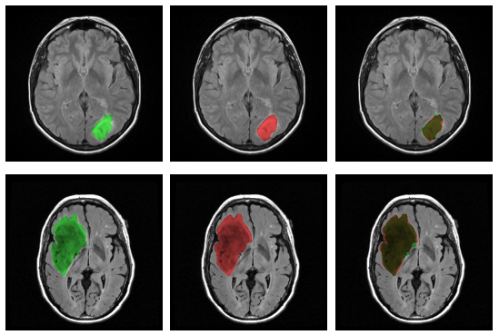

# MRI Brain Segmentation

## Content
- Introduction
- Dataset
- Visualization
- UNET Model

## Introduction
We create a model can automatically segment the tumor in Brain on MRI scans.

## [Dataset](https://www.kaggle.com/datasets/mateuszbuda/lgg-mri-segmentation)
Dataset used in:

Mateusz Buda, AshirbaniSaha, Maciej A. Mazurowski "Association of genomic subtypes of lower-grade gliomas with shape features automatically extracted by a deep learning algorithm." Computers in Biology and Medicine, 2019.

and

Maciej A. Mazurowski, Kal Clark, Nicholas M. Czarnek, Parisa Shamsesfandabadi, Katherine B. Peters, Ashirbani Saha "Radiogenomics of lower-grade glioma: algorithmically-assessed tumor shape is associated with tumor genomic subtypes and patient outcomes in a multi-institutional study with The Cancer Genome Atlas data." Journal of Neuro-Oncology, 2017.

This dataset contains brain MR images together with manual FLAIR abnormality segmentation masks.
The images were obtained from The Cancer Imaging Archive (TCIA).
They correspond to 110 patients included in The Cancer Genome Atlas (TCGA) lower-grade glioma collection with at least fluid-attenuated inversion recovery (FLAIR) sequence and genomic cluster data available.
Tumor genomic clusters and patient data is provided in data.csv file.

## Visualization

## UNET Model
The UNet is a neural network architecture used for segmentation. It is shaped like an U where the feature maps coming from the left side of the U (encoder) are passed to the right side (decoder) to produce the segmentation mask by exploiting information from different stages of the image elaboration and at different scales.

In order to transfer the features between different layers of the architecture, the UNet.py implementation exploits an activations stack and pytorch forward hooks. Moreover, the model initialization is iterative and supports a depth parameter that allows to define the architecture with an arbitrary number of blocks. During the initialization a forward hook is added to the encoding layers so that the corresponding activations are pushed in the stack. Then, the forward hook of the decoding layers pops the most recent activation from the stack and concatenates it to the layer output.

